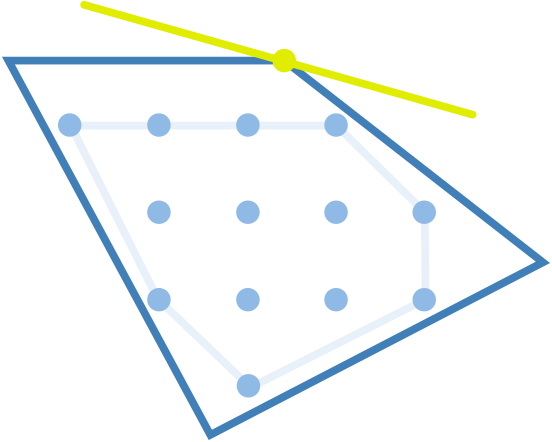
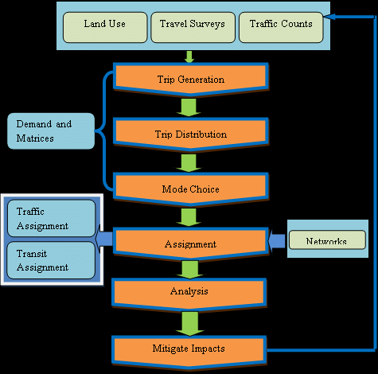
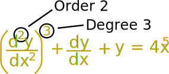

# Class notebook at UWM

## Overview

| Course                                                       | Title                                                | Level                        | Link                            |
| ------------------------------------------------------------ | ---------------------------------------------------- | ---------------------------- | ------------------------------- |
|  | Engineering Dynamics  CE202                     | undergraduate                | [Notebook](CE202/Dynamics.md)   |
|  | Computer/statistics  CE280                      | undergraduate                | [Notebook](CE280/statistics.md) |
|      | Strength of Materials CE303                     | undergraduate                | [Notebook](CE303/CE303.md)      |
|  | Soil Mechanics  CE335                           | undergraduate                | [Notebook](CE335/README.md)     |
|             | Operation Research IndEng455                    | undergraduate; graduate | [Notebook](IndEng455/README.md) |
|      | Algorithm Design and Analysis CS535             | undergraduate; graduate | [Notebook](CS535/README.md)     |
|  | Urban Transportation Planning CE590             | undergraduate; graduate | [Notebook](CE590/README.md)     |
|            | Mathematics,linear algebra,diff equations CE601 | undergraduate; graduate | [Notebook](Math601/math601.md)  |
|  | Statistical Inference Math761-762               | graduate                     | [Notebook](Math7612/stat762.md) |

