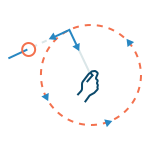
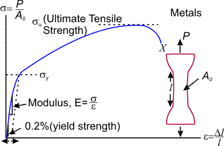
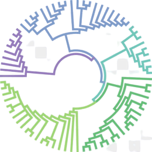

# Roadmap
## Devloper notes
* Backend
* * [ASGI vs WSGI](DevNotes/backend.md)
* [Python Black Magic ](DevNotes/PythonBlackMagic.md)
## Productivity 
* [search syntax in Everything](/productivity/search?id=everything)
* [syntax cases for regular expression](/productivity/cheatsheet/cheat_regularExpression.md)

## Features

| **Priority** | ![][p0]  ![][p1]  ![][p2] |
| ------------ | :----------------------------------------------------------- |
| **Scope**    | ![][lg] ![][md]  ![][sm] |
| **Status**   | ![][not-started] ![][in-progress] ![][delivered] |

## Tasks
* ![][p0-medium]![][in-progress]
* ![][p1-medium]![][in-progress]
* [mouseover : tooltip ][not-started]
# Cloud stack notes
* GPT-SoVITS :   
* Markdown Roadmap Example [Kepler.gl 2019 Roadmap](https://raw.githubusercontent.com/wiki/keplergl/kepler.gl/Kepler.gl-2019-Roadmap.md)
# web application
*  HTML2PNG -[![][001colab]](https://colab.research.google.com/github/jinsanity07git/livedc/blob/main/notebooks/PrintasPNG.ipynb) 
*  holiydayCalc [![][001colab]](https://colab.research.google.com/github/jinsanity07git/livedc/blob/main/notebooks/holidays.ipynb)
# Transportation technical notes

* [TRR 1996-2007 TOC](Research/TRR_TOC.md)

* [TDM23 User Guide](https://ctpsstaff.github.io/tdm23_users_guide/1.0/)

* tdm23 model call stack -[Sankey Chart](https://ctpsstaff.github.io/tdm23_users_guide/1.0/pages/_assets/gisdk_assets/sankey_chart.html)
* TransCAD_bin -[![][001colab]](https://colab.research.google.com/github/jinsanity07git/TransCAD_bin/blob/colab/notebooks/bin2df.ipynb ) 

* [trafficvis](https://trafficvis.com/) : *CEE 310: Transportation Engineering * at University of Illinois at Urbana-Champaign

  * [Dilemma Zones](https://trafficvis.com/dilemma-zone)

  * [Construction Zone](https://trafficvis.com/construction-zone)

  * [Space vs. Time Mean Speed](https://trafficvis.com/space-mean)

  * [Fundamental Diagram](https://trafficvis.com/fundamental-diagram)

  * [Three Fundamental Diagrams](https://trafficvis.com/fundamental-diagrams)

    These are created by [Dr. Lewis Lehe](https://lewislehe.com/). Check out the [Urban Traffic and Economics Lab](https://lehelab.com/) to learn more about his group's research.
  
* [uknow](https://github.com/jinsanity07git/uKnow)

Example tag

# Class notebook at UWM

## Overview

| Course                                                       | Title                                                | Level                        | Link                            |
| ------------------------------------------------------------ | ---------------------------------------------------- | ---------------------------- | ------------------------------- |
|  | Engineering Dynamics  CE202                     | undergraduate                | [Notebook](CE202/Dynamics.md)   |
|  | Computer/statistics  CE280                      | undergraduate                | [Notebook](CE280/statistics.md) |
|      | Strength of Materials CE303                     | undergraduate                | [Notebook](UWM/CE303/CE303.md)      |
|  | Soil Mechanics  CE335         | undergraduate                | [Notebook](UWM/CE335/README.md)     |
|             | Operation Research IndEng455                    | undergraduate; graduate | [Notebook](UWM/IndEng455/README.md) |
|      | Algorithm Design and Analysis CS535             | undergraduate; graduate | [Notebook](UWM/CS535/README.md)     |
|  | Urban Transportation Planning CE590      | undergraduate; graduate | [Notebook](UWM/CE590/README.md)     |
|            | Mathematics,linear algebra,diff equations CE601 | undergraduate; graduate | [Notebook](UWM/Math601/math601.md)  |
|  | Statistical Inference Math761-762            | graduate                     | [Notebook](UWM/Math7612/stat762.md) |
|        | SimaaS CE998                                    | graduate                     | [Notebook](UWM/CE998/CE998.md)      |

# Reference

[not-started]: https://img.shields.io/badge/-not_started-lightgrey.svg?style=flat-square "Not Started"

[in-progress]: https://img.shields.io/badge/-in_progress-blue.svg?style=flat-square "In Progress"

[delivered]: https://img.shields.io/badge/-delivered-green.svg?style=flat-square " Delievered"

[p0]: https://img.shields.io/badge/-P0-red.svg?style=flat-square&colorB=rgba(177,0,38,0.8) "P0"
[p1]: https://img.shields.io/badge/-P1-orange.svg?style=flat-square&colorB=rgb(253,141,60) "P1"
[p2]: https://img.shields.io/badge/-P2-yellow.svg?style=flat-square&colorB=rgb(254,217,118) "P2"

[lg]: https://img.shields.io/badge/-large-blue.svg?style=flat-square&colorB=rgba(1,102,94,0.9) "Large"
[md]: https://img.shields.io/badge/-medium-green.svg?style=flat-square&colorB=rgb(90,174,100) "Medium"
[sm]: https://img.shields.io/badge/-small-yellowgreen.svg?style=flat-square&colorB=rgb(166,216,90) "Small"

[p0-large]: https://img.shields.io/badge/P0-large-red.svg?style=flat-square&colorA=rgba(177,0,38,0.8)&colorB=rgb(90,174,97) "P0-Large"

[p0-medium]: https://img.shields.io/badge/P0-medium-red.svg?style=flat-square&colorA=rgba(177,0,38,0.8)&colorB=rgb(90,174,97) "P0-Medium"

[p0-small]: https://img.shields.io/badge/P0-small-red.svg?style=flat-square&colorA=rgba(177,0,38,0.8)&colorB=rgb(166,216,90) "P0-Small"

[p1-large]: https://img.shields.io/badge/P1-large-red.svg?style=flat-square&colorA=rgb(253,141,60)&colorB=rgba(1,102,94,0.9) "P1-large"

[p1-medium]: https://img.shields.io/badge/P1-medium-red.svg?style=flat-square&colorA=rgb(253,141,60)&colorB=rgb(90,174,97) "P1-Medium"

[p1-small]: https://img.shields.io/badge/P1-small-red.svg?style=flat-square&colorA=rgb(253,141,60)&colorB=rgb(166,216,90) "P1-Small"

[p2-large]: https://img.shields.io/badge/P2-large-red.svg?style=flat-square&colorA=rgb(254,217,118)&colorB=rgba(1,102,94,0.9) "P1-large"

[p2-medium]: https://img.shields.io/badge/P2-medium-red.svg?style=flat-square&colorA=rgb(254,217,118)&colorB=rgb(90,174,97) "P2-Medium"

[p2-small]: https://img.shields.io/badge/P2-small-red.svg?style=flat-square&colorA=rgb(254,217,118)&colorB=rgb(166,216,90) "P2-Small"

[001colab]: https://img.shields.io/badge/colab-gold "Small"