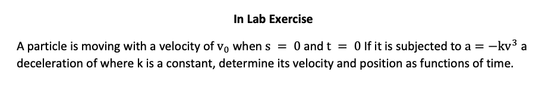

## Problem

$$
s = 0 \\
t = 0 \\
v = v_0 \\
a = - k v^{3} \\
v = f(t) = ? \\
s = f(t) = ?
$$

$$
v = \frac{ds}{dt} \\
a = \frac{dv}{dt}
$$

### Part 1:

Substitute acceleration  $a$
$$
\frac{dv}{dt} = - k v^{3} \\
$$
Separable equation in First ODE 
$$
\frac{1}{ v^{3}} dv = - k  \ dt \\
v^{-3} dv = -k dt
$$
Integrate both side  
$$
\int_{v_0}^{v} v^{-3} dv = \int_{0}^{t} -k dt \\
\frac{1}{-2} v^{-2} \mid_{v_0}^{v}= -kt \mid_{0}^{t} \\
\frac{1}{-2} v^{-2} - \frac{1}{-2} {v_0}^{-2}  =  -k t  \\
v^{-2} = 2kt + v_0^{-2} \\
v = [{2kt + v_0^{-2}}]^{-1/2} \\
$$

### Part 2:

Substitute velocity $v$ with $\frac{ds}{dt}$
$$
\frac{ds}{dt} = [{2kt + v_0^{-2}}]^{-1/2}  \\
$$
Separable equation in First ODE 
$$
ds = [{2kt + v_0^{-2}}]^{-1/2} \ dt \\
\int_{0}^{s}ds = \int_{0}^{t} [{2kt + v_0^{-2}}]^{-1/2} \ dt \\
$$
Use u substitution 
$$
let \ u = {2kt + v_0^{-2}}  \\
thus \ \frac{du}{dt} =  2k  \\
dt = du/2k \\

\int_{0}^{s}ds = \int_{v_0^{-2}}^{{2kt + v_0^{-2}} } u^{-1/2} \ du/2k \\
$$
Integrate both side   
$$
s = \frac{1}{2k} \cdot 2 \cdot u^{1/2} \mid_{v_0^{-2}}^{{2kt + v_0^{-2}}} \\
s = \frac{u^{1/2}}{k} \mid_{v_0^{-2}}^{{2kt + v_0^{-2}}} \\
s = \frac{1}{k} [ \left( {2kt + v_0^{-2}}  \right)^{1/2}    - {v_0}^{-1} ]
$$

## Numerical test

### K = 5  and $v_0$ = 1

<iframe width="100%" height="800px" src="CE202/lab/numerical/k5_v1.html"></iframe>

### K = 50  and  $v_0$  = 10

<iframe width="100%" height="800px" src="CE202/lab/numerical/k50_v10.html"></iframe>

### K = 0.5  and  $v_0$  = 0.1

<iframe width="100%" height="800px" src="CE202/lab/numerical/k0.5_v0.1.html"></iframe>

