Computer/statistics 

**Computr Based Engr Analys**

**Course Objectives**: Provide students with basic tools for computer-based analysis of engineering problems including data analysis, graphing, curve fitting, equations solving, basic probability and statistics, regression, goodness-of-fit, etc.

```
7 Mar 11 Mid-term Exam
 15 May 6 Review
 16 May 13 Final Exam: 1
```

**Review guide** : focus on homework and solutions

### Content

- references: Montgomery_Engineering_Statistics_5th_txtbk_CE 280C
- C4: 172 -253 /546
- C5:  254-321/546


[TOC]


### C4 Decision Making for a Single Sample 

[Standard Normal Distribution Table- interactive](https://www.mathsisfun.com/data/standard-normal-distribution-table.html) 

[Interactive web apps for exploring statistical concepts - Art of Stat](http://www.artofstat.com/webapps.html)

#### Basic Concepts:

* `hypothesis tests`
* construct` confidence intervals `
  * on the mean of a normal distribution 
  * on the variance of a normal distribution 
  * on a population proportion 
* `power  `
* `type II error `
* ` sample-size selection decisions `
* `prediction interval `
* `tolerance interval`
* `chi-square goodness-of-fit test`

#### 4-1 STATISTICAL INFERENCE 

* `Statistical inference  `
  * `population`
  * `random sample`
  * type
    * parameter estimation  <br> eg. estiamting mean value
    * hypothesis testing <br>drawing conclusions about a stated hypothesis 

4-2 POINT ESTIMATION

* point estimates of parameters 

  * population mean 
  * population variance 

* point estimator<br> $ \hat\Theta  = h(X_1, X_2, . . . , X_n)  $[^1]

  * The proportion $p$ of items in a population that belong to a class of interest 
  * $\hat p = x/n$
  * where <br>x is the number of items in a random sample of size <br>n that belong to the class of interest. 
  * sample variance $S^2$
  * sampel deviation $S$

* unbiased estimator <br> for the parameter $\theta$  if  

  $ E(\hat\Theta) = \theta $

*  minimum variance unbiased estimator (MVUE) <br>all unbiased estimators of $\theta$, the one with the smallest variance is called  

  *  method of maximum likelihood 

* mean square error   <br>the expected squared difference between  $\hat\Theta$  and  $\theta$  

  $ MSE(\hat\Theta) = E((\hat\Theta-(\theta)^2$

  * $ MSE(\hat\Theta) = V(\hat\Theta) + (bias)^2$

* relative efficiency

  * $ MSE(\hat\Theta_1) /MSE(\hat\Theta_2) $

*  $V(\hat\Theta) $ can be thought of as the variance of the sampling distribution of $\hat\Theta $ 

  * `standard error ` : precision of estimation

* 

#### 4-3 HYPOTHESIS TESTING 

##### 4-3.1 Statistical Hypotheses 

* `hypothesis` : statement
* `hypothesis testing` : decision  making procedure
* `comparative experiment`
* `statistical hypothesis`: <br> A statistical hypothesis is a statement about the parameters of one or more populations. <br>a statement about the probability distribution of a random variable
* null hypothesis 
* alternative hypothesis 
  * two-sided alternative hypothesis 
  * one-sided alternative hypothesis

* Three methods used to test hypotheses: 

1. The traditional method
2. The P-value method
3. The confidence interval method

After stating the hypotheses, 
selects the **correct statistical test**, 
chooses an **appropriate level of significance**, 
and **formulates a plan** for conducting the study.


##### 4-3.2 Testing Statistical Hypotheses 


* `critical region`: rejection region 
* `critical value:` separates the critical region from the noncritical region
* `test value` : The numerical value obtained from a statistical test

z = 2.33 for α = 0.01 (Right-Tailed Test) 

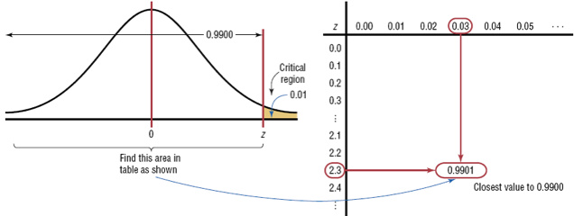

Procedure Table

Finding the Critical Values for Specific α Values, Using Table E

**Step 1  Draw the figure and indicate the appropriate area.**

	a. If the test is left-tailed, the critical region, with an area equal to α, will be on the left side of the mean.
	
	b. If the test is right-tailed, the critical region, with an area equal to α, will be on the right side of the mean.
	
	c. If the test is two-tailed, α must be divided by 2; one-half of the area will be to the right of the mean, and one-half will be to the left of the mean.

**Step 2  Find the z value in Table E.**
​	a. For a left-tailed test, use the z value that corresponds to the area equivalent to α in Table E.
​	b. For a right-tailed test, use the z value that corresponds to the area equivalent to 1 – α.
​	c. For a two-tailed test, use the z value that corresponds to  α / 2 for the left value. It will be negative. For the right value, use the z value that corresponds to the area equivalent to 1 – α / 2. It will be positive. 


**Solving Hypothesis-Testing Problems** 
**(Traditional Method)**

* critical value 
* test value

Step 1  State the hypotheses and identify the claim.
Step 2  Find the critical value(s) from the appropriate table in 			 			
​		Appendix C.
Step 3  Compute the test value. : Z
Step 4  Make the decision to 
​	     reject or not reject the null hypothesis.
Step 5  Summarize the results.

EX: PPT chap08_33-35


In the hypothesis-testing situation, there are four possible outcomes. 

* `type I error`:<br>Rejecting the null hypothesis $H_0$ <br>when it is true is defined as a type I error 
  * `significance level ` or `size` of the test
  * $\alpha = P(type I error)$
  * Typical significance levels are: 
    0.10, 0.05, and 0.01
  * For example, when α = 0.10, there is a 10% chance of rejecting a true null hypothesis.
* `type II error`: <br>Failing to reject the null hypothesis<br> when it is false is defined as a type II error. 
  * $\beta= P(type II error)$


* `standard deviation `
  * z-value
* Understanding the Relationship between $\alpha $  and  $\beta $
* `strong conclusion`
* `weak conclusion`
* `Power` <br> The power of a statistical test is the probability of rejecting the null hypothesis H0 when the alternative hypothesis is true. 
  * $1 - \beta$
  *  the probability of cor- rectly rejecting a false null hypothesis.
  * descriptive and concise measure of the **sensitivity** of a statistical test 


##### 4-3.3 P-Values in Hypothesis Testing

* `fixed significance level`: $\alpha = 0.5$
* ` P-value`: The P-value is the smallest level of significance that would lead to rejection of the null Hypothesis $H_0$. 
  *  measure of the credibility of the null hypothesis. 
  *  It measures the weight of evidence against $H_0$. 
  *  Specifically, it is the risk that you have made an incorrect decision if you reject H0.  <br>the risk of wrongly rejecting $H_0$ 


**Solving Hypothesis-Testing Problems** 
**(P-Value Method)**

* alpha(critical value )
* P-value(test value)

Step 1  State the hypotheses and identify the claim.
Step 2  Compute the test value. 
Step 3  Find the P-value.  ( The area for z )
Step 4  Make the decision.
Step 5  Summarize the results.

Example 8-6 , 8-7


##### 4-3.4 One-Sided and Two-Sided Hypotheses 

In formulating one-sided alternative hypotheses, we should remember that rejecting H0 is always a strong conclusion.<br> **Consequently, we should put the statement about which it is important to make a strong conclusion in the alternative hypothesis.** In real-world problems, this will often depend on our point of view and experience with the situation. 

##### 4-3.5 General Procedure for Hypothesis Testing Q

1-7 

1. Parameter of interest: 
2. Null hypothesis, $H_0$: 
3. Alternative hypothesis, $H_1$:  
4. Test statistic:  
5. Reject H0 if:  
6. Computations: 
7. Conclusions:  


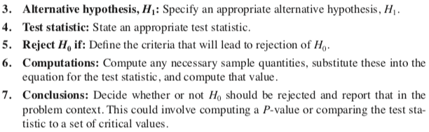

page 191/546

[Sampling distribution - Wikipedia](https://en.wikipedia.org/wiki/Sampling_distribution)

* Population	Statistic  	Sampling distribution

#### 4-4 Inference on <br/>the MEAN of a population, <br/>VARIANCE known 

* assumption (standard normal distribution )
  *   z value (Standard Value)
    * The z value is the number of standard deviations that a particular X value is away from the mean. 
    * 6.3 The Central Limit Theorem( Distribution of **Sample Means**) 
      * $\mu_x $
      *  $\sigma / \sqrt{n} $  : **standard error of the mean**
  * $Z= \frac{\bar{x} -\mu_0}{\sigma / \sqrt{n} }$ ( Distribution of Sample Means) 
    
##### 4-4.1  Hypothesis Testing on the Mean 
  * `z-test`

      * test statistic <br>$Z_0$
      * $Z_0= \frac{\bar{x} -\mu_0}{\sigma / \sqrt{n} }$

  * p-value
    * Two-tailed test
    * Upper-tailed test
    * Lower-tailed test

    

  * critical regions/ rejection region

    *  fixed significance level testing  

* cdf 

  * $\Phi(z_0)$

* summary 

  * 

* `confidence interval (CI) `

* `SE Mean `: standard error of the mean


##### 4-4.2 Type II Error and Choice of Sample Size()

* visualization tools [^2]

 

#####  Finding the Probability of Type II Error

two sided alternative hypothesis

* Probability of Type II Error
  * 
* 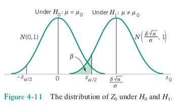
* Sample Size Formulas  $\alpha/2$
  * 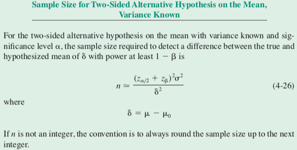

one sided alternative hypothesis

* Sample Size Formulas $\alpha$

* $n = \frac{(z_\alpha + z_\beta )^2 \sigma^2} {\sigma^2}$


##### 4-4.3 Large-Sample Test 

* In general, if $n >=40$ , the sample variance $s^2$ will be close to $\sigma^2$ for most samples
* Exact treatment of the case where $\sigma^2$  is unknown and n is small <br>involves use of the t distribution 

##### 4-4.4 Some Practical Comments on Hypothesis Testing 

The Seven-Step Procedure 

only three steps are really required: 

1. Specify the hypothesis (two-, upper-, or lower-tailed). 
2. Specify the test statistic to be used (such as $z_0$). 
3. Specify the criteria for rejection (typically, the value of $\mu$, or the P-value at which rejection should occur). 

Statistical vs Practical Significance 

* statistical significance 
* Practical Significance (engineering significance )
  * This is particularly true when the sample size n is large. 

if we test a hypothesis at a fixed significance level $\alpha$  and even if there is little practical difference between the true mean and the hypothesized value, a large sample size will almost always lead to rejection of $H_0$.  

`rejection of `$H_0$ : $1-\beta$ or $\alpha$


###### **Relation beteween Confidence Intervals and Hypothesis Testing**

* When the null hypothesis is **rejected** in a hypothesis-testing situation, 
  the confidence interval for the mean using the same level of significance will **not contain** the hypothesized mean.

* Likewise, when the null hypothesis is **not rejected**,
   the confidence interval computed using the same level of significance will **contain** the hypothesized mean. 

Example 8-30

##### 4-4.5 Confidence Interval on the Mean 


* `confidence interval (CI) ` : an interval in which we would expect to find the true mean  
  * An **interval estimate** of a parameter is an interval or a **range of values** used to estimate the parameter. 
  * by using data obtained from a sample
* `endpoint` : L U --random variable ; $P( L \leqslant \mu \leqslant U) = 1- \alpha$
  *  lower- and upper-confidence limits
  *  confidence coefficient $1- \alpha$ 
* `confidence level `(of an interval estimate of a parameter ) : 
  the probability that the interval estimate will contain the parameter 

The appropriate statement is that the observed interval [l, u] brackets the true value of 􏰁 with confidence $100(1- \alpha)%$. 

Confidence reflects the reliability of the procedure 

* two-sided confidence interval 
* one-sided confidence bound 
  * one-sided  $100(1- \alpha)%$ lower-confidence bound on 􏰁 $\mu$
    *  $P(   L\leqslant \mu ) = 1- \alpha$
  * one-sided  $100(1- \alpha)%$ upper-confidence bound on 􏰁 $\mu$
    * $P(   \mu\leqslant  U ) = 1- \alpha$ 
* `precision of the estimator`: The half-interval length 
* **Three Properties** of a Good Estimator：
  * unbiased;consistent;
  * relatively efficient
     (the relatively efficient estimator has the smallest variance.)
* The full-interval length:  quality of the information obtained from the sample 

```
The longer the CI, the more confident we are that the interval actually contains the true value of 􏰁mu. 
On the other hand, the longer the interval is, the less information we have about the true value of mu􏰁.
In an ideal situation, we obtain a relatively short interval with high confidence. 
```

**Confidence Interval on the Mean, Variance Known** 

###### Confidence Interval of the Mean for a Specific $\alpha $ 

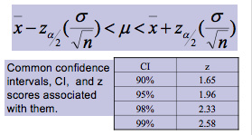

- When n>30, s can be substituted for σ.
-    
- **Maximum Error of the Estimate**  
  The maximum error of the estimate is the maximum likely difference between the point estimate of a parameter and the actual value of the parameter.
  - margin of error: $ E = z_{\alpha/2}  {(\frac{\sigma}{\sqrt{n}} )} $
- Rounding Rule 
  -  using **raw data** : 
      round off to one more decimal place than the number of decimal places in the original data. 
  - using a **sample mean** and a standard deviation:
    round off to the **same number** of decimal places as given for the mean


Example 7-1 7-2


Relationship between Tests of Hypotheses and Confidence Intervals 

Confidence Level and Precision of Estimation 

*  precision is inversely related to the confidence level 
*  It is rare to see confidence levels smaller than 90% or greater than 99.5%. 

Choice of Sample Size

$ n = ( \frac{z_{\alpha/2}\sigma} {E} )^2$ 

Note the general relationship between sample size, desired length of the confidence interval 2E, confidence level 100(1 -$\alpha$􏰅 􏰍)%, and standard deviation 􏰃$\sigma$ :  

- ●  As the desired length of the interval 2E decreases, the required sample size n increases for a fixed value of 􏰃$\sigma$ 􏰅 and specified confidence. 
- ●  As 􏰃 $\sigma$  increases, the required sample size n increases for a fixed desired length 2E and specified confidence. 
- ●  As the level of confidence increases, the required sample size n increases for fixed desired length 2E and standard deviation $\sigma$ 􏰃. 

Example 7-3 7-4


One-Sided Confidence Bounds 

##### 4-4.5 General Method for Deriving a Confidence Interval

page 208/546

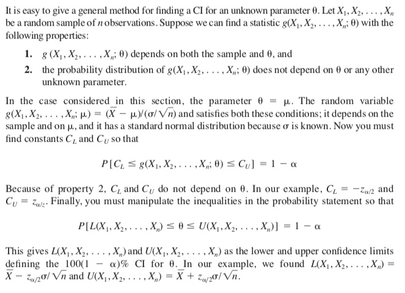


#### 4-5  Inference on the MEAN of a population, <br/>VARIANCE unknown 

when the sample is small and $\sigma^2$ is unknown  

*  underlying distribution 
     * usually is normal 
*  `inference procedures ` <br>(statistical tests and CIs)

When the assumption is unreasonable,<br> an alternative is to use **nonparametric procedures** that are valid for any underlying distribution or data transformations. 

##### 4-5.1 Hypothesis Testing on the Mean

The t  test is a statistical test for the mean of a population and is used when the population is normally or approximately normally distributed, α is unknown.

* [Normal probability plot - Wikipedia](https://en.wikipedia.org/wiki/Normal_probability_plot) 

  * [how to](http://www.statisticshowto.com/normal-probability-plot/) 

* test statistics (variance known)<br>$  Z_0 = \frac{\overline X - \mu_0}{\sigma/ \sqrt{n}}  $    

* test statistics (variance unknown)<br>$ T_0 = \frac{\overline X - \mu_0}{S/ \sqrt{n}} $  
  * sample standard deviation S 

    * The Population Standard Deviation:
      ![square root of [ (image/standard-deviation-formula-5988675.gif) times Sigma i=1 to N of (xi - mu)^2 ]](https://www.mathsisfun.com/data/images/standard-deviation-formula.gif)

    	 The Sample Standard Deviation:	 	

      ![square root of [ (image/standard-deviation-sample-5988675.gif) times Sigma i=1 to N of (xi - xbar)^2 ]](https://www.mathsisfun.com/data/images/standard-deviation-sample.gif)

  * degrees of freedom: n - 1  

  * sample size: n 
* Find the critical t value for α = 0.05 with d.f. = 16 for a right-tailed t test.

Find the 0.05 column in the top row and 16 in the left-hand column. The critical t value  is +1.746.

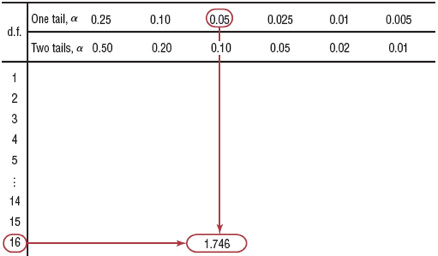

* t probability density function 
  * [Student's t-distribution - Wikipedia](https://en.wikipedia.org/wiki/Student%27s_t-distribution) [^8]
  * $\textstyle\frac{\Gamma } {\sqrt{\nu\pi}\,\Gamma \left(\frac{\nu}{2} \right)} \left(1+\frac{x^2}{\nu} \right)^{-\frac{\nu+1}{2}}\!$
  * $[Math Processing Error]{\displaystyle \Gamma }$ is the [gamma function](https://en.wikipedia.org/wiki/Gamma_function)
    * symmetric and unimodal
    * maximum ordinate value 
    * 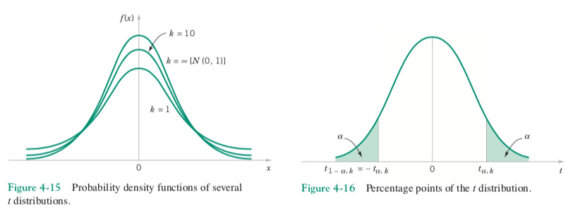

  Example 8-9 & 8-10 

  8-12 8-13 8-16

* summary  

  * page 215/546
  * 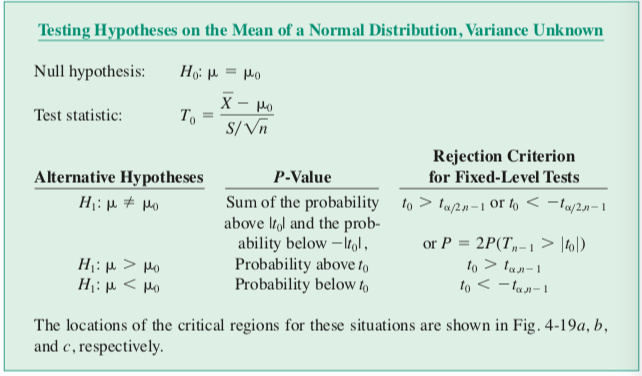

* Normal probability plot of the coefficient of restitution data 

  * ${\displaystyle {\text{Coefficient  of  restitution }}={\frac {\text{Relative  velocity  after  collision}}{\text{ Relative  velocity  before  collision}}}}$


###### Whether to use z or t

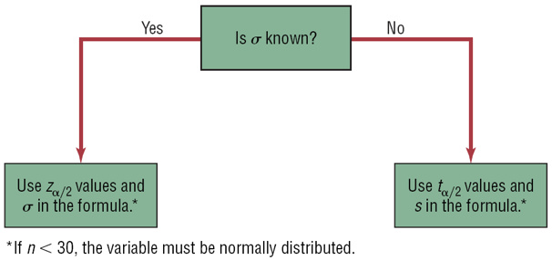

##### 4-5.2 Type II Error and Choice of Sample Size

* `noncentral t distribition`
* `central t distribition`
* `operating characteristic (or OC) curves ` ：
  * $ d = \frac{\delta}{\sigma } $ 
  * t distribution

##### 4-5.3 Confidence Interval on the Mean 

* page 220/546
* 

#### 4-6  Inference on <br/>the VARIANCE of a NORMAL population 

The chi-square distribution is also used to test a claim about a single variance or standard deviation.

Assumptions:

1. The sample must be **randomly selected** from the population.
2. The population must be **normally distributed** for the variable under study.
3. The observations must be **independent** of one another.


##### 4-6.1 Hypothesis Testing on the Variance of a Normal Population 

* test statistic 

  <br> $\Chi_0^2 = \frac{ (n-1) S^2}{ \sigma ^2}$

  * $  \sigma^2 $ = population variance
  * $  S^2 $ = sample variance

* chi-square random variable 

  * 
  * The mean and variance of the $\chi^2$ distribution are  $\mu = k ,   \sigma^2 = 2k$
  * The percentage points of the $\chi^2$ distribution are given in Table III of Appendix A 
  * 

Using Table III of Appendix A for the 􏱘 $\chi􏱘2$ distribution


Summary 

* Testing Hypotheses on the Variance of a Normal Distribution 
* 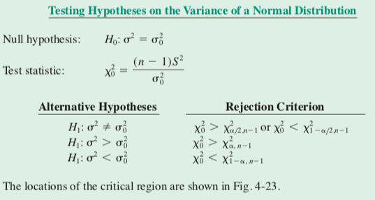


Example 8-24 8-26 8-30

##### 4-6.2 Confidence Interval on the Variance of a Normal Population 


#### 4-7 Inference on <br/> a population PROPORTION 

test hypotheses and construct CIs on a population proportion 

* points estimator 
* biomial distribution [^3]
  * the sampling distribution of $\hat P$ is approximately normal with mean p and variance p(1-p)/n, <br>if p is not too close to either 0 or 1 and if n is relatively large.  
* sampling distribution

##### 4-7.1 Hypothesis Testing on a Binomial Proportion 

* **z Test for a Proportion**
* the binomial parameter p represents the proportion of defective items produced 

Since a normal distribution can be used to approximate the binomial distribution when np >=5 and nq<=5, the standard normal distribution can be used to test hypotheses for proportions.


* `test statistic`
  *  in terms of the number of items X in the sample that belongs to the class of interest. 
  *  in terms of the sample proportion
  *    

Summary 

* Testing Hypotheses on a Binomial Proportion
* 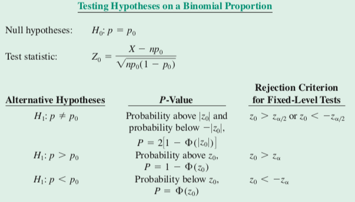 

Small Sample Tests on a Binomial Proportio 

Example 8-17 8-18


##### 4-7.2 Type II Error and Choice of Sample Size 

* approximate 􏰎$\beta$-error<br>
* Sample Size for a Two-Sided Hypothesis Test on a Binomial Proportion <br>

##### 4-7.3 Confidence Interval on a Binomial Proportion

* standard error of the point estimator $\hat P $ <br> $\sqrt {p(1-p)/n}$

* Confidence Interval on a Binomial Proportion[^4] <br>

  

* Choice of Sample Size

  * Sample Size for a **Specified Error** E on a Binomial Proportion  <br> $n=\frac {(z_{\alpha/2})^2 \cdot \hat{p}_g \cdot (1-\hat{p}_g)}{E^2} $
  * an upper bound on the sample size <br> $n=(\frac {z_{\alpha/2}} {E})^2  /4$ 

* One-Sided Confidence Bounds 

  * simply replace $z_{\alpha/2}$ with $z_{\alpha}$ in equations 

* A Different Confidence Interval on a Binomial Proportion 

  * Agresti-Coull CI
  * [Binomial proportion confidence interval - Wikipedia](https://en.wikipedia.org/wiki/Binomial_proportion_confidence_interval)


#### 4-8  OTHER INTERVAL ESTIMATES FOR A SINGLE SAMPLE 

##### 4-8.1 Prediction Interval 

A  100(1 -$\alpha$􏰅 􏰍)% PI on a single future observation from a normal distribution is given by 

 

Solving for  $ {\displaystyle X_{n+1}}![X_{{n+1}}] $  yields the prediction distribution!

$\overline {X}_{n}+s_{n}{\sqrt  {1+1/n}}\cdot T^{{n-1}}$


The probability of $ {\displaystyle X_{n+1}}![X_{{n+1}}]$ falling in a given interval is then:

$\Pr \left(\overline {X}_{n}-T_{a}s_{n}{\sqrt  {1+(1/n)}}\leq X_{{n+1}}\leq \overline {X}_{n}+T_{a}s_{n}{\sqrt  {1+(1/n)}}\,\right)=p$


where *Ta* is the 100(1 − *p*/2)th [percentile](https://en.wikipedia.org/wiki/Percentile) of [Student's t-distribution](https://en.wikipedia.org/wiki/Student%27s_t-distribution) with *n* − 1 degrees of freedom. Therefore, the numbers 

${\displaystyle {\overline {X}}_{n}\pm T_{a}s_{n}{\sqrt {1+(1/n)}}}$

are the endpoints of a 100(1 − *p*)% prediction interval for  $ {\displaystyle X_{n+1}}![X_{{n+1}}] $ 


##### 4-8.2 Tolerance Intervals for a Normal Distribution 

The interval captures the coefficient of restitution of 95% of this population

* 100(1 − *p*)% Tolerance Interval : <br>the interval from 􏰁 􏰅$\mu - z_{\alpha/2} $􏰍􏰆 to 􏰁 􏰄 $\mu + z_{\alpha/2} $􏰍􏰆 

* 


#### 4-9 goodness of fit 

* `chi-square distribution`: [Chi-squared distribution - Wikipedia](https://en.wikipedia.org/wiki/Chi-squared_distribution) 
  * the distribution of a sum of the squares of k [independent](https://en.wikipedia.org/wiki/Independence_(probability_theory)) [standard normal](https://en.wikipedia.org/wiki/Standard_normal) random variables
  * is used in the common [chi-squared tests](https://en.wikipedia.org/wiki/Chi-squared_test) for [goodness of fit](https://en.wikipedia.org/wiki/Goodness_of_fit) of an observed distribution to a theoretical one
  * [The Chi-Squared Test](https://istats.shinyapps.io/ChiSquaredTest/) 

* `df` :  degrees of freedom 

* `possion distribution`[^6] : $ f(x)=\dfrac{e^{-\lambda} \lambda^x}{x!} $ 

  * for *x* = 0, 1, 2, ... and λ > 0, 
    where λ will be shown later to be both the mean and the variance of *X*.
  * **Theorem.** The mean of a Poisson random variable *X* is λ.
  * **Theorem.** The variance of a Poisson random variable *X* is λ.

* `test statistic`: [Degrees of freedom (statistics) - Wikipedia](https://en.wikipedia.org/wiki/Degrees_of_freedom_(statistics))

* `level of significance`

* ` seven-step hypothesis testing procedure`
  1. Parameter of interest: 
  2. Null hypothesis, H0: 
  3. Alternative hypothesis, H1:  
  4. Test statistic:  
  5. Reject H0 if:  
  6. Computations: 
  7. Conclusions:  

* `P-value`

Test Statistic for the Chi-Square Goodness-of-Fit Test


* $O_i $ be the **observed frequency** in the ith class interval
* $ E_i $ be the **expected frequency** in the ith class interval

* $X^2_0  $ a chi-square distribution with k - p -1 degrees of freedom
  *  p represents the **number of parameters** of the hypothesized distribution estimated by sample statistics
  *  k bins or class interval 


### C_5 two samples

- [8.1 - Comparing Two Population Proportions with Independent Samples](https://onlinecourses.science.psu.edu/stat500/node/55/) 

  - 

    Confidence Intervals to Estimate the Difference Between Two Population Proportions:   p1−p2

    Hypothesis Testing to Compare Two Population Proportions: 
    p1, p2 

- [8.2 - Introduction to Comparing Two Population Means](https://onlinecourses.science.psu.edu/stat500/node/49/)

  - [8.3 - Independent Samples ](https://onlinecourses.science.psu.edu/stat500/node/50/) 

    - **pooled variances**

      - #### 

        **Assumption 1.** What should we do if the assumption of **independent samples** is violated?

        > If the samples are not independent but paired, we can use the **paired *t*-test**.

        **Assumption 2.** What should we do if the sample sizes are not large and the populations are not normal?

        > We can use a nonparametric method to compare two samples such as the Mann-Whitney procedure.

        **Assumption 3.** What should we do if the assumption of **equal variances** is violated?

        > We can use the **separate variances** 2-sample *t*-test.

    - **Non-Pooled Variances( separate variances )** 

  - [8.4 - Paired Data](https://onlinecourses.science.psu.edu/stat500/node/51/)  

    -  **Paired samples:** The sample selected from the first population is **related to the corresponding sample** from the second population.

    - **t-statistic**:

      > Let  *d* = differences between the pairs of data,  
      > then $\bar{d} $  = mean of these differences.
      >
      > The test statistics is: $ t^{*}=\frac{\bar{d}-0}{{s_d }/\sqrt{n}} $ 
      >
      > degrees of freedom = *n* - 1
      > where *n* denotes the **number of pairs** or the number of differences.

    - **Paired t-interval**:

      * $\bar{d}\pm t_{\alpha/2} \cdot \frac{s_d}{\sqrt{n}} $ 

    - **Note:** $ s_{\bar{d}=\frac{s_d}{\sqrt{n}}} $ where $ s_{\bar{d}} $  is the standard deviation of the sample differences.

- [8.5 - Comparing Two Population Variances](https://onlinecourses.science.psu.edu/stat500/node/54/) 

  - You need to check whether the normal assumption holds before you can use the *F*-test 
    since the *F*-test is very sensitive to departure from the normal assumption.


## Type II error and sample size 

| senario | sample size                                                  | type II error               | power     |
| ------- | ------------------------------------------------------------ | --------------------------- | --------- |
|         | $ n=\left(\sigma\frac{z_{1-\alpha}+z_{1-\beta}}{\mu-\mu_0}\right)^2 $ | $1-\beta=\Phi\left(\frac{ $ | \mu-\mu_0 |
|         |                                                              |                             |           |
|         |                                                              |                             |           |
|         |                                                              |                             |           |
|         |                                                              |                             |           |
|         |                                                              |                             |           |
|         |                                                              |                             |           |
|         |                                                              |                             |           |
|         |                                                              |                             |           |


## Rerference 

#### Cheat sheet making

* enhance picture

  * [improve photo](improvephoto.net)
  * [enhance](letsenhance.i)


#### Footnote


[^1]: [ Latex 字母上面加符号波浪线横线角号等- CSDN博客](https://blog.csdn.net/junshen1314/article/details/45156549)
[Understanding Statistical Power and Significance Testing](http://rpsychologist.com/d3/NHST/)

[^3]: [Relationship between Binomial and Normal Distributions ](http://www.real-statistics.com/binomial-and-related-distributions/relationship-binomial-and-normal-distributions/) ; [Normal Approximation to Poisson | STAT 414 / 415 - Statistics Online](https://onlinecourses.science.psu.edu/stat414/node/180/) 
[^4]: [Binomial Confidence Interval - Statistics How To](http://www.statisticshowto.com/binomial-confidence-interval/) 
[^5]: [7.3 - Decision Making in Hypothesis Testing | STAT 500 - STATONLINE](https://onlinecourses.science.psu.edu/stat500/node/40/) 
[^6]: [Lesson 12: The Poisson Distribution ](https://onlinecourses.science.psu.edu/stat414/node/54/)
[^7]: [Elementary Statistics, Sixth Edition (Bluman)](http://glencoe.mheducation.com/sites/0098402207/student_view0/chapter7/section2/eprofessor.html) 
[^8]: [Understanding the *t*-distribution and its normal approximation]( http://rpsychologist.com/d3/tdist/)


[^2]: 