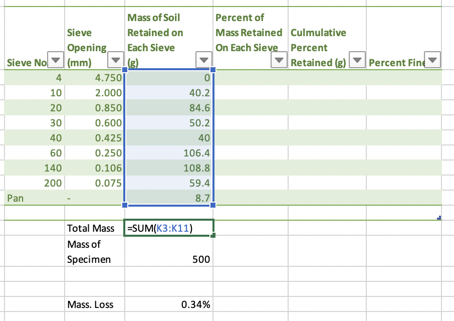
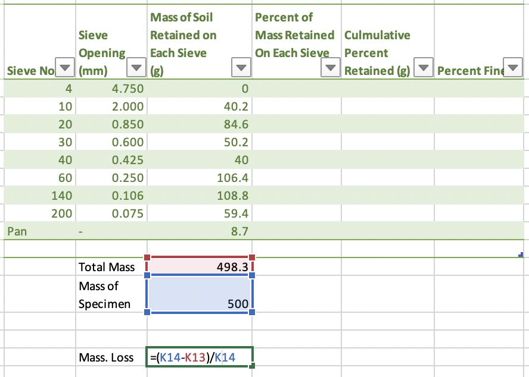
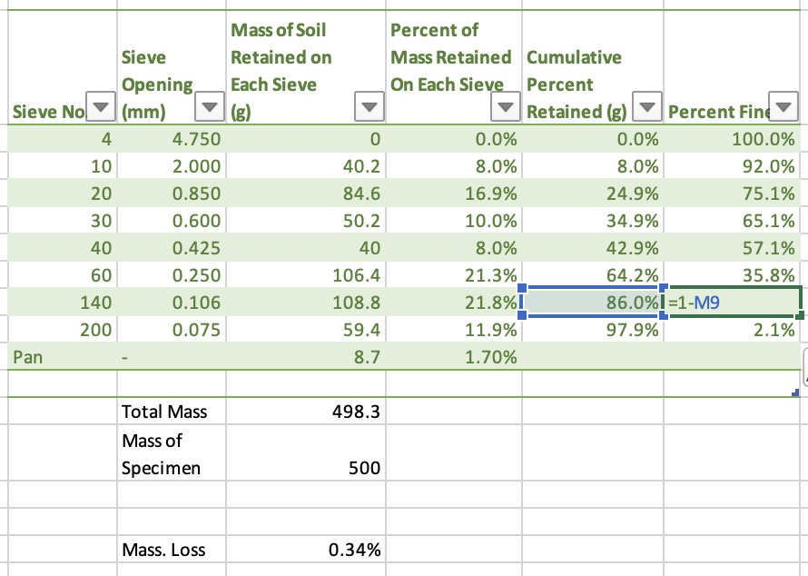
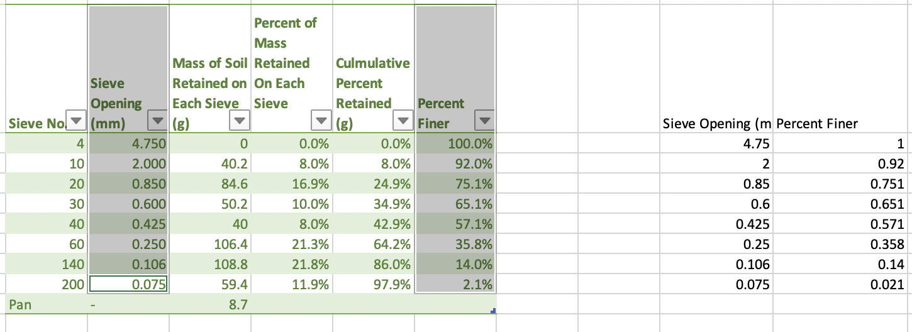
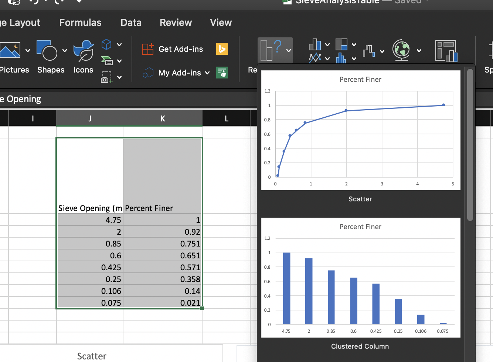
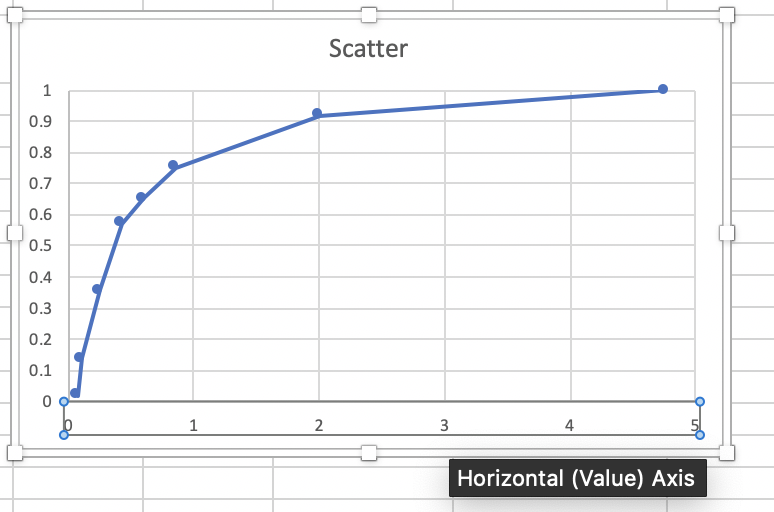
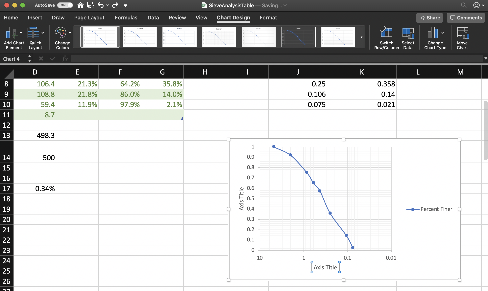

# Week2

Zihao Jin

Email: zihaojin@uwm.edu	

Office: NWQB 4535 [campus map](https://uwm.edu/children/wp-content/uploads/sites/227/2016/05/CampusMap2016.pdf),[Floor Plan]([https://panthers.sharepoint.com/sites/CPM/Shared%20Documents/Website/Space%20Management/Room%20Number%20Floor%20Plans/Floor%20Plans/NWQ-1932B.pdf?&originalPath=aHR0cHM6Ly9wYW50aGVycy5zaGFyZXBvaW50LmNvbS86Yjovcy9DUE0vRVhmSy1jd00yQTlQdDF0TmRpclh0TlFCb0xtYS14WTdnd1VPYURsUmN3OTQxQT9ydGltZT02UzRhRm9PbTEwZw](https://panthers.sharepoint.com/sites/CPM/Shared Documents/Website/Space Management/Room Number Floor Plans/Floor Plans/NWQ-1932B.pdf?&originalPath=aHR0cHM6Ly9wYW50aGVycy5zaGFyZXBvaW50LmNvbS86Yjovcy9DUE0vRVhmSy1jd00yQTlQdDF0TmRpclh0TlFCb0xtYS14WTdnd1VPYURsUmN3OTQxQT9ydGltZT02UzRhRm9PbTEwZw)) 

Office Hour:  Tuesday 1-3 P

[LabVideo](../../Soil Mechanics2019Fall/video/2-a-Carleton University - CIVE 3208 Lab 1  Sieve Analysis.mp4) 

[CourseInfo](../CourseAll.png)

### Step1 Obtain the appropriate sieves

* \# 4 gravel & sand

* \# 200 sand & silt or clay
* the maximum number of sieves： 8 

### Step2 Obtain the soil sample

* Mass of specimen: range from 500 g to 1 kg
* Zero the scale to negate the mass of  container

### Step3 Perform the test

* 3 min of shaking

### Step4 Weigh the soil in each sieve

* Brush on the back of the **sieve** with a finer grain sizes
* Not to spill any of the sample 

### Step5 Calculate total percent passed for each sieve

* Sum the total mass of material 
* Calculate the percent of mass retained on each sieve
* Cumulative percent of mass retained on each sieve
* Percent finer

 

## Calculations

[Excel Tempelate](./SieveAnalysisTable_Inlab.xlsx) 

1. Calculate `Total Mass`  and ` Mass. Loss` 

    

 

2.  Compute `Percent of Mass Retained On Each Sieve `  column: $R_n$ 

$$
\frac{\text { mass retained } M_{n}}{\text { total mass } M} \times 100=R_{n}
$$

3. Calculate `Cumulative Percent Retained` (g)

$$
\sum_{i=1}^{i=n} R_{n}
$$

 

4. Calculate the cumulative percent passing through( `Percent Finer`) the nth sieve
   $$
   \text { percent finer }=100-\sum_{i=1}^{i=n} R_{n}
   $$
   

# Graph

1. Select the target columns and copy them into blank space

2. Insert a chart, choose type of scatter.

    

3. Adjust scale of X axis

In side panel `Axis Options` , select `Maxumun axis value` ,`Logarithmic scale` and `Values in reverse order` 

4. line smoothing by double clicking the line in chart, refer to `Line` options in `Format Data Series` panel and select `Smoothed line`  

5. Under the `Chart Design` tab, choose a layout with detailed grid background within the `Quick Layout` options. Then, adjust the size properly for visually reading 

###  Side  

[What is The Function of a Sieve Shaker?](https://www.cscscientific.com/csc-scientific-blog/bid/95848/What-is-The-Function-of-a-Sieve-Shaker) 

 

 

  

[image source](https://lavallab.com/all-products/sieve-shakers-and-test-sieves/) 

# References 

* [Creating a Log/Log Chart](https://excel.tips.net/T003025_Creating_a_Log_Log_Chart)
* [Scatter Chart in Excel - Easy Excel Tutorial](https://www.excel-easy.com/examples/scatter-chart.html) 
* [Reading Values from Graphs](https://excel.tips.net/T003247_Reading_Values_from_Graphs.html) 
* [Weight or Mass?](https://www.mathsisfun.com/measure/weight-mass.html) 